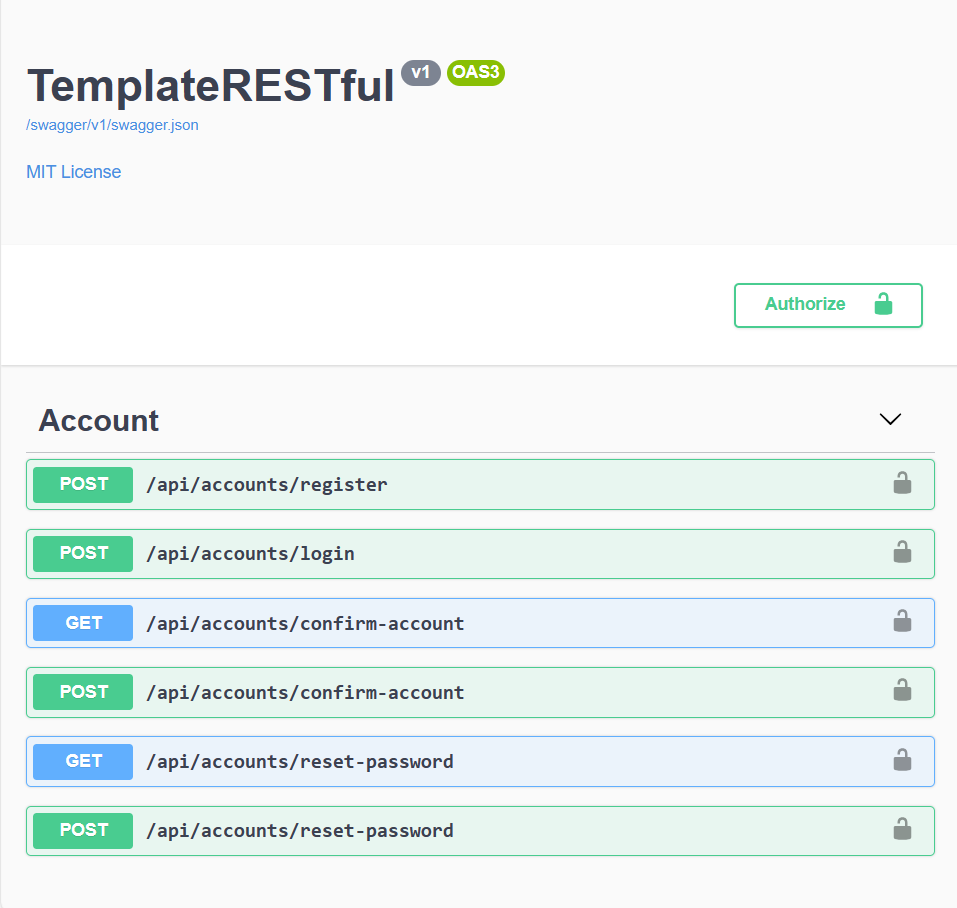
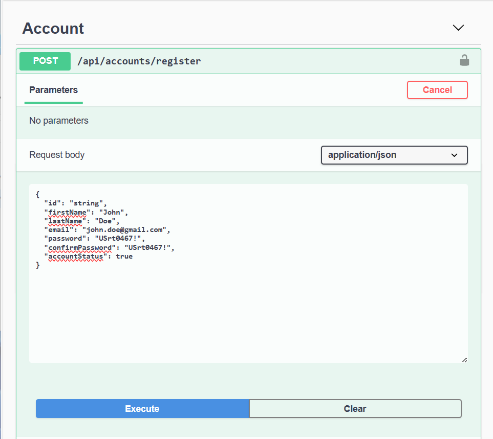
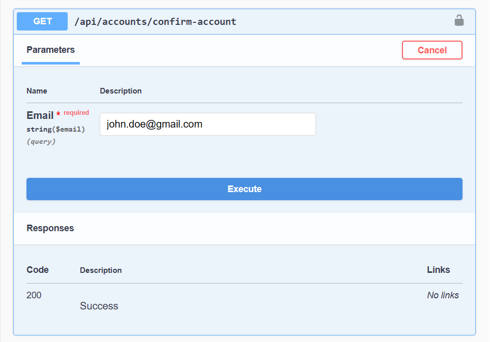
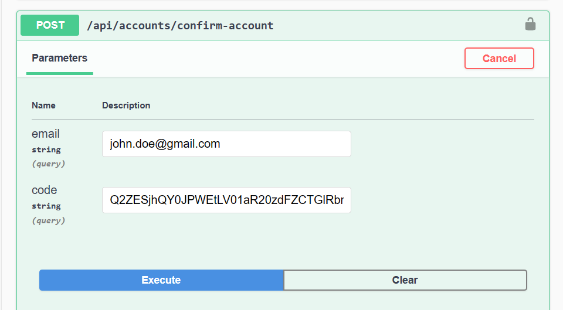
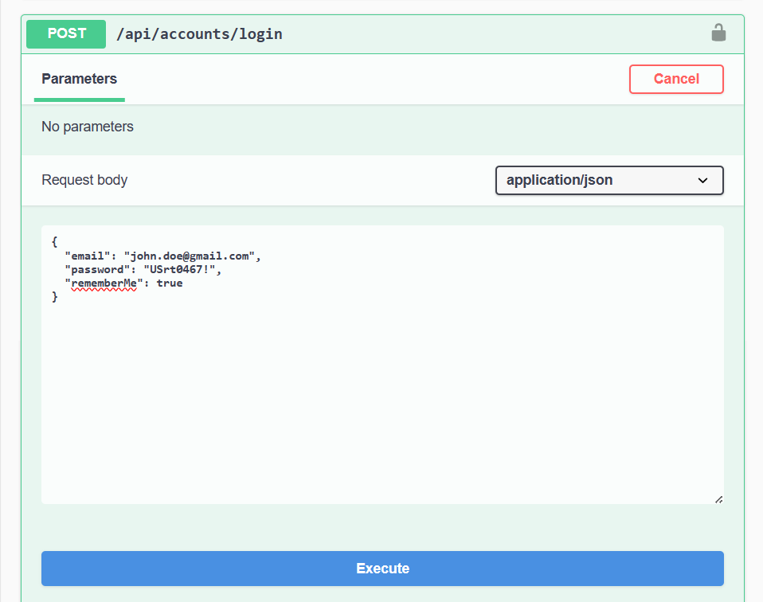
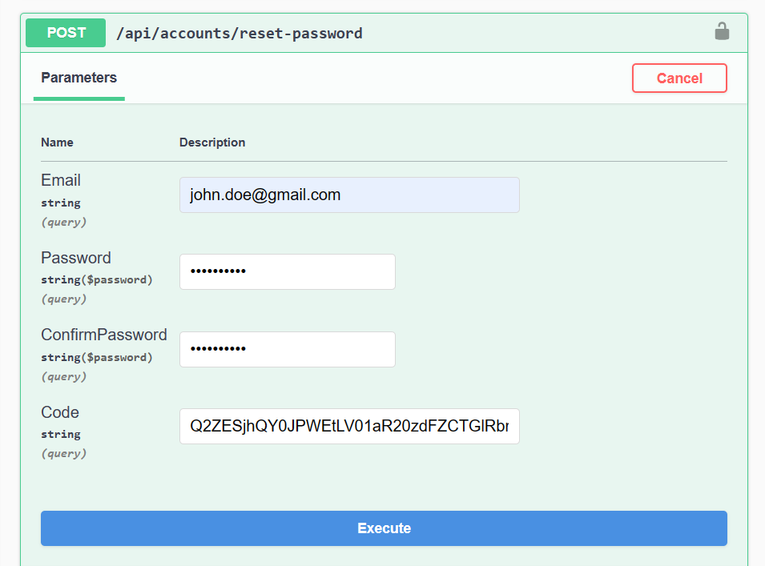

# TemplateRESTfulAPI

A template to build .NET applications using a scalable Onion Architecture that connects to multiple SQL databases

> This project uses .NET Core Identity API and includes a Web UI and a Swagger API interface.

## Table of Contents

- [Project Requirements](#project-requirements)
- [Getting Started](#getting-started)
- [Current Features](#current-features)
- [API Usage](#api-usage)

## Project Requirements

- [Visual Studio 2019 or later](https://visualstudio.microsoft.com/downloads/)

- [Microsoft .NET SDK v5.0.400](https://dotnet.microsoft.com/en-us/download/dotnet/5.0)

- [SQL Server 2019 or later](https://www.microsoft.com/en-us/sql-server/sql-server-downloads)

- [SQL Server Management Studio](https://learn.microsoft.com/en-us/sql/ssms/download-sql-server-management-studio-ssms?view=sql-server-ver16)

> Make sure you **select** <em>x64</em> version of the architecture

## Getting Started

<details>
  <summary>Open the Template in Visual Studio</summary>

  <div align="left">
     
  </div>
</details>

<details>
  <summary>Configure local path for Database</summary>

1. Expand the <em>TemplateRESTful.API</em> and <em>TemplateRESTful.Web</em> folders

  <div align="left">
   
  </div>

2. Open the <em>appsettings.json</em> file

 <div align="left">
     
</div>

3. Replace the following database settings

```SQL
Server=myServerAddress;Database=myDataBase;
```

with the correct settings for your Database Server

```SQL
  Data Source=SQL_SERVER\\SQL_DATABASE;Initial Catalog=DATABASE_NAME;
```

</details>

<details>
  <summary>Populate the Database with initial data</summary>

1. Click on **Tools** in the program menu bar
2. Then go to <em>NuGet Package Manager</em> and click on **Package Manager Console**

3. Run the following <em>command</em> to seed database

```cmd
  update-database -context IdentityContext
```

> For the <em>default project</em>, select the **TemplateRESTful.API**

</details>

<details>
  <summary>Select a Project to load the <strong>API or Web</strong></summary>

  <div align="left">
    
  </div>

Right click on the <em>project solution</em>, and select <strong><em>Set as a Startup Project</em></strong>

</details>

<details>
  <summary>Run and build the <strong>API or Web</strong></summary>

Select the <em>TemplateRESTful.API</em> or <em>TemplateRESTful.Web</em>, then click on **IIS Express**

  <div align="left">
    
  </div>

</details>

## Current Features

<details>
  <summary>Template features for Account users</summary>

- Users

  - 1. Send email for each Confirm and Reset action
  - 2. Display quick notifications for user actions

- Accounts

  - 1. Register a new account
  - 2. Confirm account by clicking on a confirmation code
  - 3. Login account using credentials or gmail login
  - 4. Reset credentials by generating a reset token
  - 5. Change account password

- Admin
  - 1.  Admin user can see login information from regular users
  - 2.  Require Admin to login using Two Factor Authentication

</details>

## API Usage

How to use **Accounts** API endpoints

<details>
  <summary>Pre-release Version - v1.0</summary>

`https://localhost:44313/swagger/index.html`



</details>

<details>
  <summary>Register [POST]</summary>

`https://localhost:44313/api/accounts/register`



</details>

<details>
  <summary>Confirm Account [GET]</summary>

`https://localhost:44313/api/accounts/confirm-account`



</details>

<details>
  <summary>Confirm Account [POST]</summary>

`https://localhost:44313/api/accounts/confirm-account`



</details>

<details>
  <summary>Login [POST]</summary>

`https://localhost:44313/api/accounts/login`



</details>

<details>
  <summary>Reset Password [GET]</summary>

`https://localhost:44313/api/accounts/reset-password`


</details>

<details>
  <summary>Reset Password [POST]</summary>

`https://localhost:44313/api/accounts/reset-password`



</details>
