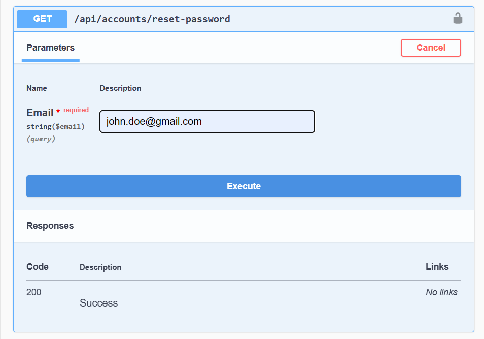

# TemplateRESTfulAPI

A template to build .NET applications using a scalable Onion Architecture that connects to multiple SQL databases

This project uses .NET Core Identity API and includes a Web UI and a Swagger API interface.


How to use the API endpoints: 

## Version

``` https://localhost:44313/swagger/index.html```


## Register [POST]

``` https://localhost:44313/api/accounts/register ```


## Confirm Account [GET]

``` https://localhost:44313/api/accounts/confirm-account ```


## Confirm Account [POST]

``` https://localhost:44313/api/accounts/confirm-account ```


## Login [POST]

``` https://localhost:44313/api/accounts/login ```


## Reset Password [GET]

``` https://localhost:44313/api/accounts/reset-password ```



## Reset Password [POST]

``` https://localhost:44313/api/accounts/reset-password ```


